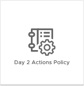
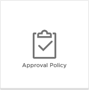

There are four types of Policy that can be created under the Definitions page.

* [Resource Quota Policy](/Content-and-Policies/Policies/Definitions/#resource-quota-policy)
* [Lease Policy](/Content-and-Policies/Policies/Definitions/#lease-policy)
* [Day 2 Actions Policy](/Content-and-Policies/Policies/Definitions/#day-2-actions-policy)
* [Approval Policy](/Content-and-Policies/Policies/Definitions/#approval-policy)



The Policy Name, Description, Scope and Criteria configuration are common accross all four policy types:

* **Name** - Name of the Policy
* **Description** - Description of the Policy
* **Scope**
  * **Organization / Multiple Projects** - apply the policy to the entire organization, or use *Project* selection criteria based on Project Name, ID and Description
  * **Project** - apply the policy directly to a single *Project*
* **Resource Quotas**
  * **Scope Level**
    * **Organization Limits** - apply the Resource Quota to the entire *Organization*
    * **Organization User Limits** - apply the Resource Quota to each user in the *Organization*
    * **Project Limits** - apply the Resource Quota to the entire *Project*
    * **Project User Limits** - apply the Resource Quota to each user in the *Project*
  * **Criteria** - Criteria refine the scope of where the Policy applies - 

## Resource Quota Policy
> Resource quota policies control the amount of resources that can be consumed by each user, project, or organization.

  * **Resource** - the Resource to restrict 
    * **CPU** - limit the CPU count
    * **VM Count** - limit the number of VMs
    * **Memory** - limit the RAM usage (GB)
    * **Storage** - limit the storage usage (GB)
  * **Limit** - the numerical limit of the *Resource* specified, for example the number of CPUs or VMs, or the ammount of RAM or Storage in GB.

### Example Resource Quota Policy

In the example resource quota policy below a limit is set for both the Test and Development Projects. Each Project has a total limit of 20CPUs and 256GB RAM, and each user in either Project can deploy up to 5 VMs in total.



## Lease Policy
> Lease policies control how long deployments are available for use before they are destroyed and the resources are reclaimed.

* **Enforcement type** - *Hard*, or *Soft* - a Hard Policy will override a conflicting Soft Policy
* **Maximum Lease** (days) - the number of days a deployment can be leased for, and the number of days a deployment's lease can be renewed for
* **Maximum Total Lease** (days) - the maxiumum number of days a deployment can be leased for, including lease renewals and *Grace period*
* **Grace period** (days) - the number of days after a deployment lease has expired that the deployment will be destroyed

### Example Lease Policy
In the below example lease policy any deployment that has resources that are tagged with the `Lease:Temporary` tag will have a maximum lease of 3 days, and cannot be renewed because the maximum total lease is also 3 days, and when the lease expires the deployment will be destroyed immediately because the grace period is set to 0 days.



## Day 2 Actions Policy
> Day 2 Action policies control what group of users can run the selected actions on deployed resources.

* **Enforcement Type** - *Hard*, or *Soft* - a Hard Policy will override a conflicting Soft Policy
* **Role** - select the *Administrator*, *Member* or a custom role that the policy will apply to
* **Actions** - select one or more out-of-the-box Day 2 actions, or Custom Day 2 actions to enable using this policy

### Example Day 2 Actions Policy

In the example day 2 actions policy below, Members of the Development Project will be allowed to use the PowerOff, PowerOn, Reboot, Reset, Shutdown and Suspend day 2 actions on any deployed vSphere Cloud Machines.



## Approval Policy

> Approval policies control who must agree to a deployment or day 2 action before the request is provisioned.

* **Approver mode** - *Any* allows any user from the Approvers group to approve the request, *All* requires all of the users in the Approvers group to approve the request
* **Approvers** - a list of users or groups that can approve the request
* **Auto expiry decision** - automatically approve or reject the request if the *Auto expiry trigger* is reached without an *Approver* responding 
* **Auto expiry trigger** - the number of days (up to 7) *Approvers* have to respond before the *Auto expiry decision* takes effect
* **Actions** - a list of actions that the approval policy will apply to

### Example Approval Policy

In this example approval policy the scope is limited to the "TMC Kubernetes Cluster - Custom" Cloud Template in the Production Project. Any use of the custom Day 2 action to add a new Node Pool to the resource will require approval by the listed Approvers.


